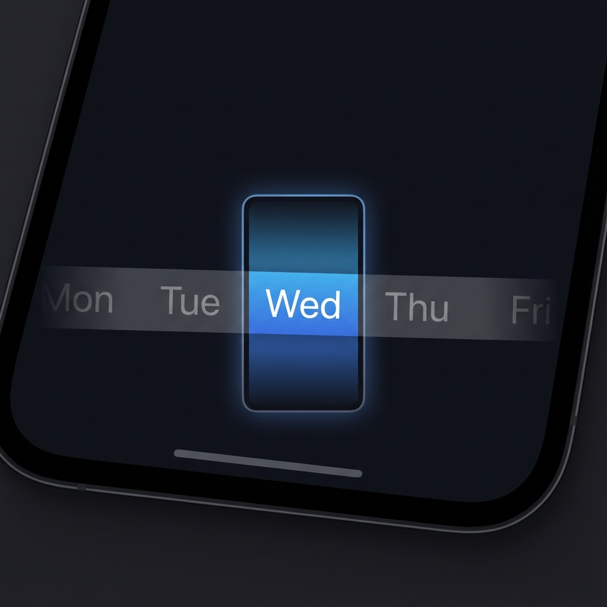
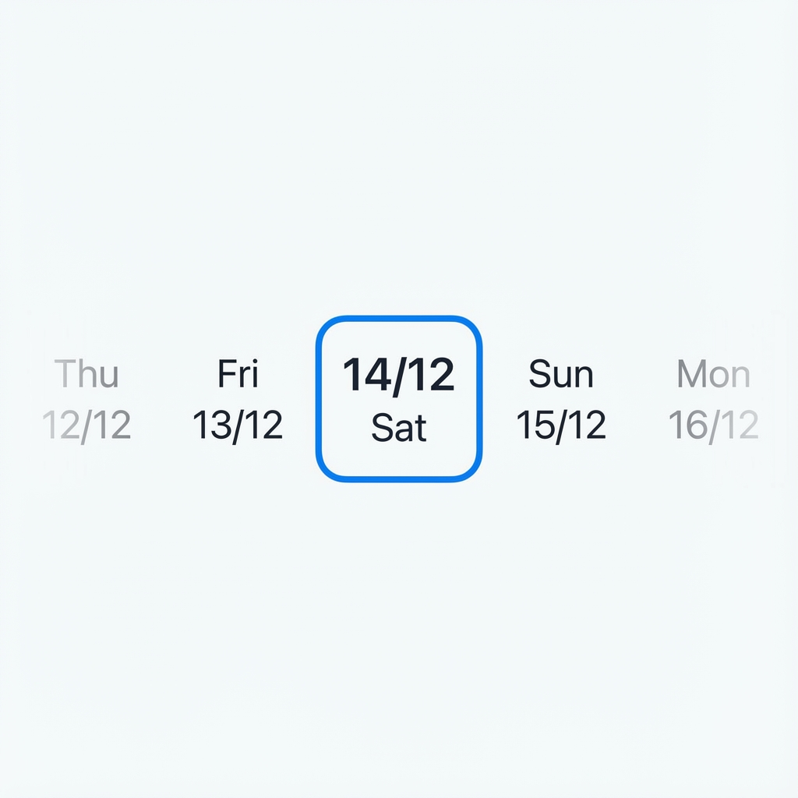

# react-native-horizontal-wheel-picker

A beautiful, customizable horizontal wheel picker for React Native with smooth animations.

<p align="center">
  
  
</p>

## ✨ Features

- 🎨 **Fully Customizable** - Every style and animation can be customized
- 🚀 **Smooth Animations** - Powered by `react-native-reanimated`
- 📱 **RTL Support** - Right-to-left languages supported
- 🎯 **Snap to Item** - Natural scroll snapping behavior
- 🔧 **TypeScript** - Full TypeScript support out of the box

## 📦 Installation

```bash
npm install react-native-horizontal-wheel-picker
# or
yarn add react-native-horizontal-wheel-picker
```

### Peer Dependencies

```bash
npm install react-native-reanimated
```

## 🚀 Quick Start

```tsx
import { HorizontalWheelPicker } from 'react-native-horizontal-wheel-picker';

const days = ['Mon', 'Tue', 'Wed', 'Thu', 'Fri', 'Sat', 'Sun'];

export default function App() {
  return (
    <HorizontalWheelPicker
      data={days}
      renderItem={({ item, isSelected }) => (
        <View style={isSelected ? styles.selected : styles.normal}>
          <Text>{item}</Text>
        </View>
      )}
      keyExtractor={(item) => item}
      onSelect={(item, index) => console.log('Selected:', item)}
    />
  );
}
```

## 📖 Props

| Prop | Type | Default | Description |
|------|------|---------|-------------|
| `data` | `T[]` | **required** | Array of items |
| `renderItem` | `(info) => ReactElement` | **required** | Render function |
| `keyExtractor` | `(item, index) => string` | **required** | Key extractor |
| `itemWidth` | `number` | `60` | Width of each item |
| `initialIndex` | `number` | `0` | Initial selected index |
| `selectedIndex` | `number` | - | Controlled mode |
| `onSelect` | `(item, index) => void` | - | Selection callback |
| `height` | `number` | `60` | Container height |
| `snapToItem` | `boolean` | `true` | Enable snap |

## 🎨 Custom Animation

```tsx
<HorizontalWheelPicker
  animationConfig={{{
    opacityRange: [0.2, 0.5, 1, 0.5, 0.2],
    scaleRange: [0.7, 0.85, 1, 0.85, 0.7],
  }}
  // ...other props
/>
```

## 📌 Ref Methods

```tsx
const pickerRef = useRef<HorizontalWheelPickerRef>(null);

// Scroll to index
pickerRef.current?.scrollToIndex(5);

// Get current index
const index = pickerRef.current?.getSelectedIndex();
```

## 📄 License

MIT © [nguyenphp](https://github.com/nguyenphp)
